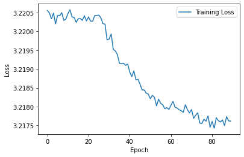
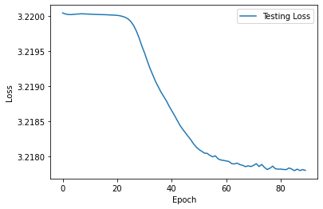
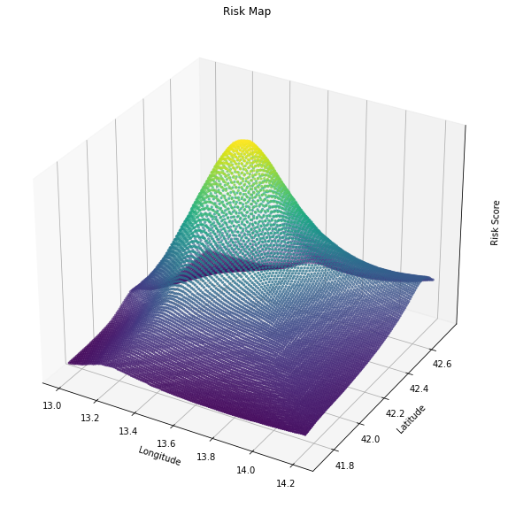
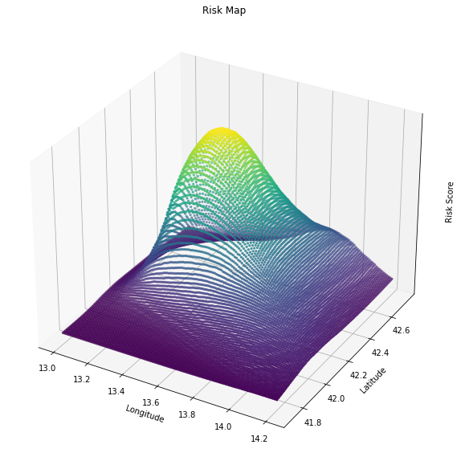
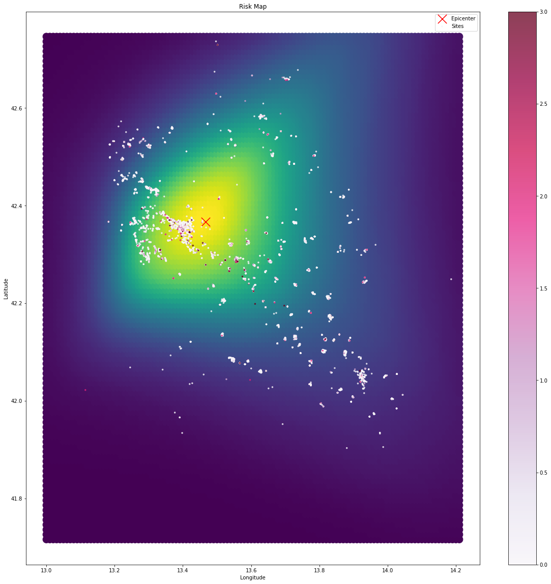

The goal of this work is to study the damage level of buildings after the 2008 earthquake that devastated the italian city "L'Aquila" and its surroundings. The dataset contains info about around 50'000 buildings. The goal is to predict the damage level of each building, which is a categorical variable with 4 levels, using a range of information regarding the buildings such as the number of floors, age of the building, latitude and longitude of the building etc. 
More details about the dataset can be found in the data_preprocessing notebook where we created a one-hot signature for each building. It is worth noting that the model will not be given the coordinates of the epicenters of the earthquakes, but we will show that the model can identify the highest risk area despite this and automatically center it on the epicenters of the earthquakes.

For an in depth explaination of the code, look at the notebook.ipynb file. 
The model used is a neural network that takes the vectorial signature of each building and tries to predict the damage as a classification problem. It is worth reporting that a-priori class weights were implemented in the loss function to account for heavy class imbalance in the dataset.
Here we report a partial training log for a fully connected neural network.

    

    


    

    


    

    


    

    


    

    


    

    

    Test Score:
                   precision    recall  f1-score   support
    
               0       0.93      0.54      0.68      7955
               1       0.08      0.20      0.12       493
               2       0.16      0.53      0.25       480
               3       0.11      0.31      0.16       790
    
        accuracy                           0.50      9718
       macro avg       0.32      0.40      0.30      9718
    weighted avg       0.78      0.50      0.59      9718
     
    

    
    


Training can take a while, so we can also load a previously trained model.


```python
# model = pickle.load(open('model_narrow_condensed.pkl', 'rb')) 
model = pickle.load(open('model_25x6.pkl', 'rb'))
print(f"Number of parameters: {sum(p.numel() for p in model.parameters() if p.requires_grad)}")
```

    Number of parameters: 5129
    

Now we can use a trained model to study the coordinate dependency of the damage level. We do this by creating ficticious buildings with the same one-hot signature as the real ones and varying the coordinates. We then use the trained model to predict the damage level of these ficticious buildings and calculate the average damage level for each coordinate.


```python
risk_map = plot_risk_map_unnormalized(model, train_loader, grid_size=0.01)
```


    

    


    

    


The plot shows the epicenter of the main event in the 2009 earthquake series as a red cross, while the dots represent the recorded sites in the testing dataset. The dots are color-coded based on their actual damage in the dataset, which ranges from 0 to 3, specifically damage to the staircase structure. However, looking at the damages recorded in the testing dataset alone is insufficient for identifying the highest risk zone. This is because the damage of each building is linked not only to its coordinates but also to its individual building characteristics, such as construction quality or number of floors.

To ensure that the model is deriving useful insights from the data, it is crucial to prove that it can separate the spatial dependency of damage from all other building properties. To achieve this, we created dummy buildings with the same characteristics as those in the dataset, but with different coordinates. These buildings were placed on a grid centered around the epicenter, and the vector representation of each dummy building was provided as input to the trained model. The model predicted the damage level for each building if it were located at the chosen point, and the expected damage for each point on the grid was calculated and averaged.

By averaging over many different buildings for each point, the aim is to cancel out the dependence on all other variables, highlighting only the spatial dependence. This also allowed for the interpolation of a 'continuous' risk map, even for points where no buildings were present.

We can clearly see that the model is able to identify the zone around the epicenter as the highest risk zone. This is despite the fact that the model was not given the coordinates of the epicenter as input. Thus we conclude that our approach is able to separate the coordinate dependency from the building signature dependency as the highest risk zone is centered around the actual epicenter and is scarcely biased towards the highest population zone.

Once ensthablished this capability, the same procedure can be applied to all building properties in the same way we did for its coordinates, by choosing a property and averaging over dummy buildings. In this case, instead of a continuous map, we will get a series of bar plots that show what the average damage would be by fixing a particular value for each column in the original dataset and averaging over a large number of dummy building like in the example above. Here the results are ordered by increasing predicted damage.


    

    


    

    


    

    


    

    


    

    


    

    


    

    


    

    


    

    


    

    


    

    


```python
scores
```


    {'identificativoposizioneedificio': {'Isolato': 0.9175756573677063,
      'Estremità': 1.0007202625274658,
      'Interno': 1.0412635803222656,
      'Angolo': 1.0893187522888184},
     'sez3_struttura_orizzontale_1': {'Travi con soletta rigida': 0.255505234003067,
      'Travi con soletta semirigida': 0.7402758002281189,
      'Non identificata': 1.1491047143936157,
      'Volte senza catene': 1.2664128541946411,
      'Travi con soletta deformabile': 1.320230484008789,
      'Volte con catene': 1.4239555597305298},
     'sez2_altezzamediapiano': {'>5.0': 0.8148795962333679,
      '3.50-5.0': 0.9623379111289978,
      '<2.50': 0.9821979999542236,
      '2.50-3.50': 1.004939317703247,
      'Non compilato': 1.225766658782959},
     'sez2_pianiinterrati': {2: 0.816217303276062,
      1: 0.8660218119621277,
      0: 1.0364272594451904,
      'Non compilato': 1.2268985509872437,
      '>2': 1.8349454402923584},
     'sez3_struttura_verticale_1': {'Muratura buona qualità': 0.5155381560325623,
      'Struttura Mista telaio-muratura di buona qualità': 0.5871578454971313,
      'Struttura Mista telaio-muratura di cattiva qualità': 0.8489401340484619,
      'Non identificata': 1.0860259532928467,
      'Muratura cattiva qualità': 1.1521917581558228},
     'sez2_numeropiani': {10: 0.001852232962846756,
      11: 0.02510804682970047,
      9: 0.05309734493494034,
      1: 0.11175139248371124,
      'Non compilato': 0.62142413854599,
      2: 0.8843383193016052,
      3: 1.1261576414108276,
      4: 1.173183798789978,
      8: 1.3920559883117676,
      5: 1.4177814722061157,
      7: 1.665157437324524,
      6: 2.1639225482940674},
     'sez2_superficiepiano': {'>3000': 0.09034781157970428,
      '<50': 0.864889919757843,
      '50-70': 0.990224301815033,
      '70-100': 1.1017699241638184,
      '100-130': 1.1040337085723877,
      'Non compilato': 1.1945873498916626,
      '130-170': 1.2261781692504883,
      '170-230': 1.23502779006958,
      '230-300': 1.312204122543335,
      '650-900': 1.3627289533615112,
      '300-400': 1.4289977550506592,
      '500-650': 1.5423955917358398,
      '1600-2200': 1.649825096130371,
      '1200-1600': 1.7735130786895752,
      '2200-3000': 1.8093229532241821,
      '400-500': 1.9116073846817017,
      '900-1200': 1.9705700874328613},
     'sez3_pilastriisolati': {'si': 0.791520893573761, 'no': 1.0192426443099976},
     'sez2_costruzioneristrutturazione1': {'1992-2001': 0.3444124162197113,
      '1972-1981': 0.34996911883354187,
      '1982-1991': 0.38022226095199585,
      '>2001': 0.38104549050331116,
      '1962-1971': 0.6654661297798157,
      '1946-1961': 0.7513891458511353,
      '1919-1945': 1.0112162828445435,
      '<1919': 1.172257661819458},
     'sez7_morfologia_versante': {'Pendio forte': 0.9186046719551086,
      'Cresta': 1.0006173849105835,
      'Pianura': 1.0405433177947998,
      'Pendio leggero': 1.0477464199066162},
     'sez4_danno_strutturale_scale': {}}


